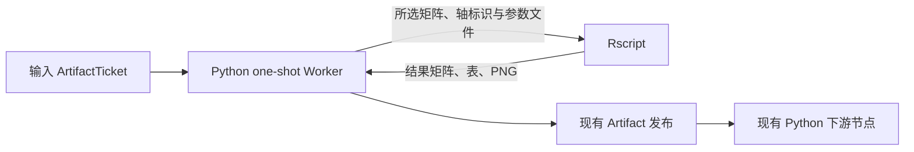

# R 分析节点：一次性验证

问题：保持现有 ArtifactTicket、Python one-shot Worker 和 RunLease，实现真实 R 计算，再把结果交给现有 Python 节点，是否可行？

**结论：可行，当前文件执行架构已提供合适的接入点。推荐第一颗 R 节点使用 Python Worker 调用普通 Rscript 子进程，Python 负责已有 Artifact 编解码和发布。**

这是独立实验分支 `codex/r-worker-prototype` 的原型，基于 `57eb64e`；没有注册生产节点或修改生产模块。



## 实测结果

| 验证 | 结果 | 证据 |
| --- | --- | --- |
| 真正的 R 数值计算 | R `stats::prcomp` 和 `Matrix::rowSums`，dense/CSR 两个 6×3 输入，与 NumPy 数值校验一致；PCA 比较投影 Gram 矩阵以消除合法的符号差异 | `results/numeric-report.json` |
| 节点接口 | 通过原有 `execute_artifact_node` 返回 AnnData、Table、PNG 的 ArtifactTicket，以及标准 summary/字符串端口；大数组只在产物中 | `run_probe.py`, `operations_r.py` |
| 混合 DAG | R 结果交给生产 `Subset Observations` 节点，选出 3 个细胞，R 嵌入随观察轴正确切片 | `results/numeric-report.json` |
| 数据保留 | 输入文件 SHA-256 不变；测试中的独立 Raw、layers、图、旧嵌入、Unicode/NA 字面 ID、分类顺序/未使用类别、nullable integer/boolean 和嵌套 uns 均保留 | `results/dense-output.h5ad`, `results/csr-output.h5ad` |
| 成功发布和回收 | R 完成后原子发布，最后一个引用释放后运行目录被回收 | `results/lifecycle-final-report.json` |
| R 失败 | 真实 R 非零退出及 stderr 进入 WorkerResponse，partial 产物不发布并清理 | 同上 |
| 取消 | 先确认真实 R PID 存活，再取消现有 worker 调用；R PID 随进程树退出，4.25 秒后没有迟到写入，partial 被清理 | 同上 |
| 原生 R 模型文件 | R 内完成 `saveRDS` / `readRDS` PCA 模型一致性检查；尚不是 typed RDS 输出端口 | `r_analysis.R` |
| 整份 H5AD 原生 R 往返 | 测得 Raw 丢失、矩阵 dtype 改变、字符串编码兼容问题，以及修改 uns 后项目 codec manifest 不一致；另有本机二进制依赖启动不稳定 | `h5ad_report.md` |

核心路径实测环境：Python 3.13.5、AnnData 0.13.2、R 4.5.3、Matrix 1.7.6、jsonlite 2.0.0，Windows。原生 H5AD 实验另用了 anndataR 1.0.2 / rhdf5 2.54.1；它的成功观察与最后失败重跑在单独报告中明确区分。这里没有把测试版本的行为推断为所有 R reader 的行为。

## 接入建议

第一颗具体 R 节点只需增加它的节点定义、Python operation 和固定 R 脚本。operation 沿用已有 `(context, inputs, parameters) -> output records` 接口，R 不需要理解 ArtifactTicket 或重写发布逻辑。已有 edgeR/Milo 的 rpy2 路径可保留。

Python 持有完整 AnnData，R 只读取算法需要的数据、返回声明的新增结果。这样不必让所有 Python/R 库完整理解彼此的 Raw、模型对象、元数据和扩展编码。细胞/特征顺序与矩阵方向要写清楚：本实验是 cells×genes；SCE/Seurat 的接口通常需要另一方向。

本次使用 Matrix Market + JSON 作为最小公共格式，并验证 R PNG 可以直接发布、R 数值表可以交给现有 Python table codec。生产的大数据路径应按实际算法选择经过验证的稀疏文件或只读 H5AD 选定槽位；本实验没有测量大数据性能，也没有建议统一把全部数据转成文本矩阵。

当一个真实节点需要输出 R 专有模型时，可以增加专门的 RDS Artifact 类型和 codec，由后续 R 节点消费。当前 RDS 检查仅证明小型 PCA 对象的原生文件保存/读取，没有实现跨节点的模型版本、持久化或恢复契约。

生产化时还需完成这些具体接口细节：

- 明确选择 Rscript 和 R library 环境；把实际 R、所用包版本及脚本身份放进运行记录和缓存身份。当前 Python WorkerIdentity 不能代表 R 环境。
- 保留用户选择的表达来源和参数；不在桥接时推断 counts 状态、替用户换 assay 或加入额外方法学门槛。
- 将 R 脚本作为安装包资源发布；沿用现有 stdout/stderr tail、异常响应、取消和原子发布。
- 当前原型 `code` 端口运输的是 R 脚本，需准备好的交换文件。若生产节点保持当前完整等价代码约定，输出可包含 R 程序的 Python 复现脚本，覆盖文件准备、R 执行和结果回填。
- Python Worker 加 R 子进程会叠加内存与 I/O；可以在 R 执行前释放桥接时的 Python 大对象、执行后重读输入进行回填。应以第一个真实算法的测量决定，原型没有做通用运行时或内存调度框架。

如果后续确实需要完全不依赖 Python 科学环境的 R worker，再提炼启动命令、环境探测和运行时身份这一 seam。ArtifactTicket、RunLease 和发布流程无需因此重做。

## 运行

所有原型源文件及输出只在此目录。R 安装在独立的 `C:\Users\admin\.cache\openbio-r-prototype`，未添加到项目依赖、未修改全局 PATH。主仓库与 main 保持原状。

在实验 worktree 中运行核心数值与节点链路：

```powershell
& 'D:\learn\ComfyUI\.venv\Scripts\python.exe' '.scratch/r-worker-prototype/run_probe.py' `
  --rscript 'C:\Users\admin\.cache\openbio-r-prototype\lib\R\bin\x64\Rscript.exe' `
  --r-bin 'C:\Users\admin\.cache\openbio-r-prototype\Library\bin' `
  --r-home 'C:\Users\admin\.cache\openbio-r-prototype\lib\R'
```

将脚本名称改为 `lifecycle_probe.py` 可重跑成功、失败、取消验证；其 `--output` 参数接受 JSON 报告文件路径。H5AD 的归档比较和原生 reader 的局限见 `h5ad_report.md`。

R 的 Windows locale 启动警告保留在报告中；核心结果与 UTF-8 标识验证仍通过。取消实验验证现有 worker 取消路径和真实 R 子进程，没有声称实际点击过 ComfyUI 的取消按钮。复制出的 H5AD 是检查证据，未被声明为 manifest 校验的 Persisted artifact。

源码依据：`worker_client.py` 的 Python 启动/探测及进程树管理，`artifact_service.py` 的请求转换与原子发布，`artifact_codecs.py` 的 H5AD/table/PNG 编解码，以及 `docs/adr/0002-file-artifacts-and-one-shot-workers.md`。

参考：[R prcomp](https://stat.ethz.ch/R-manual/R-devel/library/stats/html/prcomp.html)、[anndataR 原生接口](https://anndatar.scverse.org/reference/read_h5ad.html)、[anndataR 实现状态](https://anndatar.scverse.org/articles/development_status.html)。原生 H5AD 的测量结论以当前目录里的实际版本与文件证据为准。
